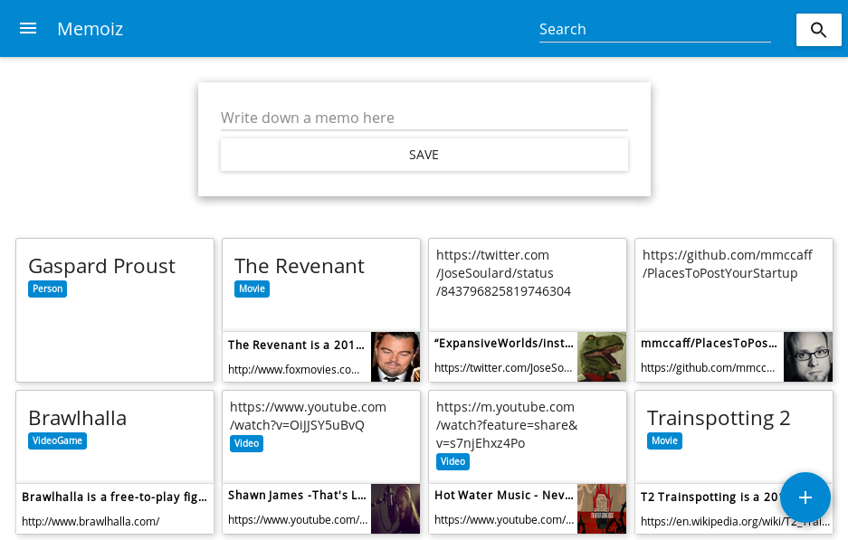
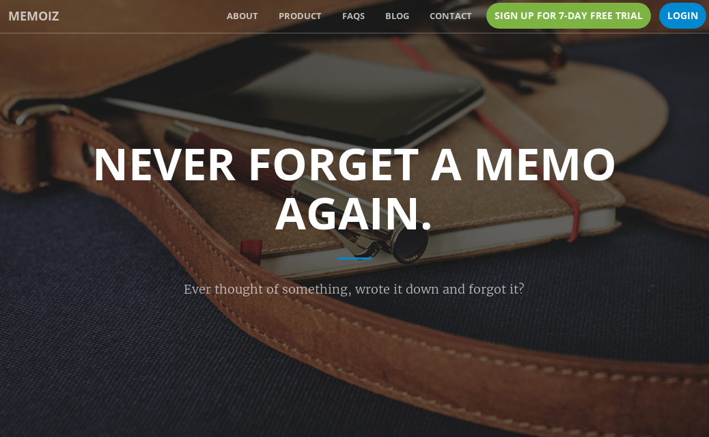

# Memoiz

Never forget a memo again. https://memoiz.com

Write down everything as memo and they’ll be automatically enriched by learning algorithms. Moreover, emails and push notifications will remind you in order to never forget your memos again.




# Frontend

[The React front-end code.](https://github.com/remeh/memoiz-front)

# Setup

```
psql -U postgres
# drop database memoiz; drop role memoiz;
# \ir resources/schema.sql; \ir resources/bing.sql; \ir resources/kg.sql
# \q
go generate ./...
go build
```

The binary sending emails is in the sub-package: `sendmail`. Just run `go build` to compile it.

# Configuration

You must provide some environment vars to start the daemon:

```
CONN
  Connection string to PostgreSQL. E.g.
    host=localhost sslmode=disable user=memoiz dbname=memoiz password=memoiz
KG
  Your Google Apps API key to use the Google Knowledge-Graph API.
BING
  Your Azure API key to use the Azure Semantics search engine.
APP_URL
  Url on which will run your daemon. E.g.
    http://localhost:3000 or https://memoiz.com
STRIPE_KEY
  Your Stripe API key for payments.
```

The sendmail binary also have some enviromnents vars to set:

```
CONN
  Connection string to PostgreSQL. E.g.
    host=localhost sslmode=disable user=memoiz dbname=memoiz password=memoiz
SMTP_HOST, SMTP_LOGIN, SMTP_PWD, SMTP_PORT
  Configuration of your SMTP servers.
EMAIL_DUMP_DIR
  The sendmail binaries will store sent emails in this directory for troubleshooting.
RES
  Path to the Memoiz resources directory (for template, css, etc. used in emails)
```
